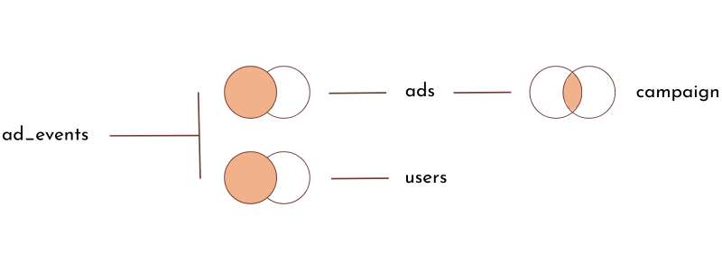
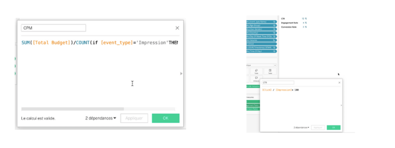
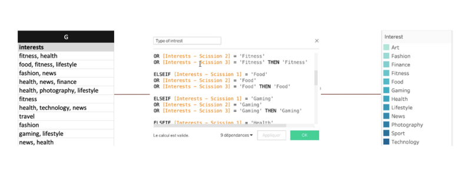
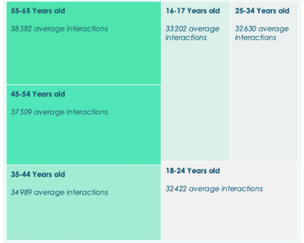
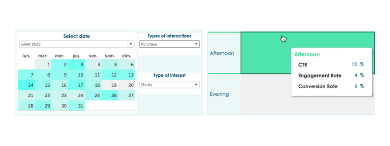

<h1 align="center">📈 Uncovering What Impacts Social Ad Performance — Tableau Project</h1>

  
  
  

---

## 🧭 Project Overview

A company launched multiple social media ad campaigns (Facebook & Instagram) targeting different segments by **age, gender, interests, and country**.  

**Source of the project:**  [Kaggle dataset](https://www.kaggle.com/datasets/alperenmyung/social-media-advertisement-performance)

 ❓ Business objective

> **The goal of this analysis is to understand what drives ad performance and optimize the user journey from the first impression to the final purchase.**

---

## 🗃️ Data set

- **Ad Events** — interaction log capturing the full funnel (impressions → clicks → conversions)
- **Users** — demographics & interests for segmentation
- **Ads** — creatives & targeting parameters
- **Campaigns** — budget, duration, timeline, strategy metadata

---

## 📊 KPIs

- **CTR** — Click-Through Rate  
- **Conversion Rate**
- **Engagement Rate**
- **CPC** — Cost per Click
- **CPM** — Cost per Thousand Impressions
- **CPA** — Cost per Acquisition

---

## 🧪 Method & Approach

**1) Data Formatting** 

Standardized date formats for consistent time-based analysis.

**2) Calculated Fields & KPIs** 

Created Tableau calculated fields for all KPIs above (CTR, CPC, CPM, CPA ect).

**3) Interest Dimension Management**

Cleaned & segmented the **Interest** dimension into meaningful sub-categories.

**4) Correlation & Relational Analysis**  

Explored relationships between campaign settings, audience attributes, and ad events.

**5) Dynamic Filters**  

Interactive filters such as interaction type, date range, and interest categories, along with a tooltip displaying KPI details, enabled flexible and intuitive exploratory analysis.

---

## 🖥️ Dashboard

**Turnig data into insight**
- The 35–44 age group provides the best ROI and should be prioritised in future campaigns

- The 55–65 age group drives traffic but converts less, meaning the content and journey may need to be tailored for them

- The afternoon is the most efficient period for conversions and should guide scheduling

- Image formats on both Facebook and Instagram show the most consistent performance and should remain a priority

- Travel and News themes have the strongest impact on purchase behaviour and should be leveraged further

- Videos show higher performance at the end of the funnel and should be tested more in retargeting campaigns

### ▶️ Watch the video of the dashboard [View the demo video](https://drive.google.com/file/d/1AEF1CMOqHP5WQHTHYbZTj3geTsT3MKSi/view?usp=drive_link)
